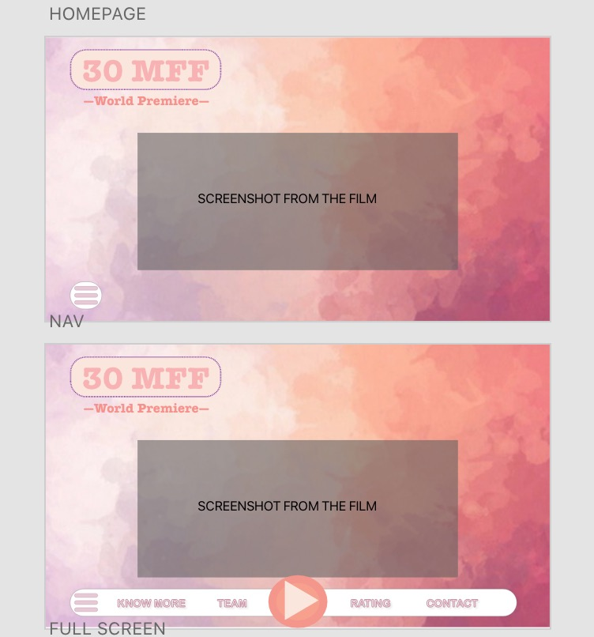
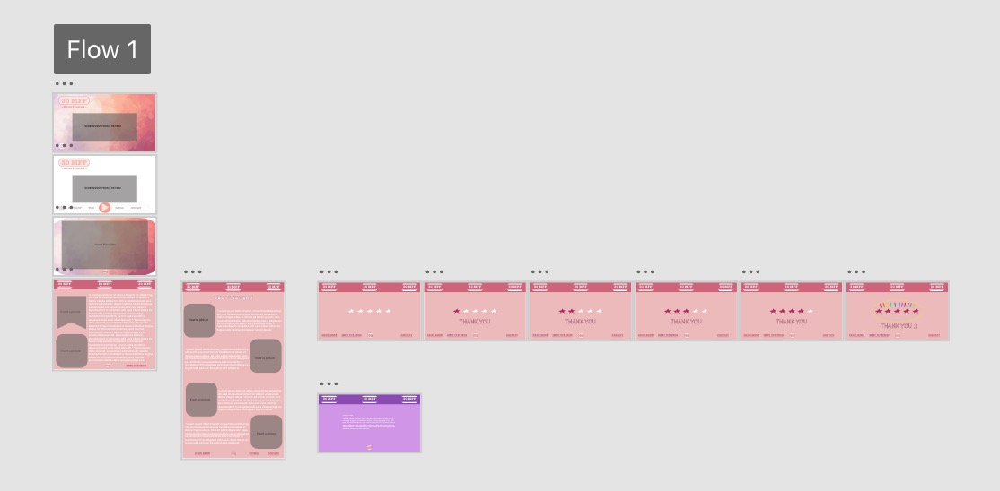

# YokiXue.github.io
Fall 2020 CommLab

**Project Name: 30MFF---Cloning objects on ZOOM**
===================

The main purpose of this web-page is to display a short film *"Cloning items on ZOOM"*. This is my first web design work. It is not that refined and aesthetically appealing, but very meaningful to me. Hope you like it :>

Project Description
----------

Since this website only aims to present the film & related info and to receive feedback from the audience, I want to keep the style simple and clear. It was conceived as a one-page website with the embedded video at the center, and under the header would be the navigation menu with four pathways: "KNOW MORE"(background story and inspiration), "OUR TEAM" (profile pics and names of members), "RATING" (audiences can rate the movie by selecting 1-5 stars), and CONTACT(contact info and links).

Process
----------

I first identified the content and style I wanted to include. Apart from what the professor suggested, I wanted to include an interactive section to get feedback, because this could make the page more interesting and leave a deeper impression on people. I then built a prototype using Adobe XD to simulate the flow between elements(below). 

By actually prototyping my conception, I reconsidered a lot of pre-assumed ideas and it also reminded me of some missed designs, such as the "back to top" button which should exist on a long web page. Then I started with the HTML and CSS script, which lasted for more than a week. I kept modifying and adjusting it. Finally, I reached a relatively qualified state. After learning script.js, I tried to add more interactivity.

Steps:
1. Determine the goals;
2. Plan/conception;
3. Prototype/Scratch;
4. Code code code.
5. Modify

Reflection/Evaluation
----------
I learned from this assignment both theoretically and practically. On one side, the biggest takeaway is that I have a deeper understanding of the relationship and division among HTML, CSS, and javascript. The metaphor can be that HTML is flesh, CSS is the skin and javascript is the soul. The three are closely related. In practice, I also gained a lot. For example, each time I added an element in HTML I would immediately refer to its CSS and change its style, but then when I added other elements, I had to readjust everything which wasted a lot of time. But now I know how to balance the order to be more efficient.
